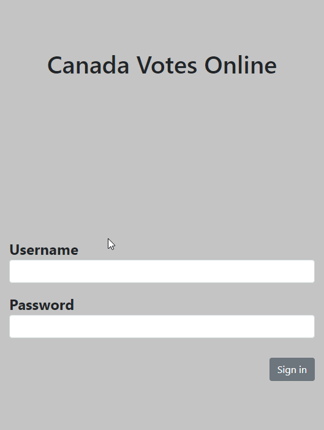

# Voting Application
Enable eligible voters to vote online and view election results. 

## Getting Started
All of the files can be loaded with your browser. Copy the files to your local directory and open localhost:5000.

### Prerequisites
A browser. Chrome was used for testing. 

### Installing
1. Go to https://github.com/ruthtech/voting-app and click on the "Clone or Download" button. 
2. Choose "Download ZIP". 
3. Unzip into a directory. If you're on Windows, open File Explorer and navigate to the download directory. Select the ZIP file, right click, and choose "Extract All". Accept the default location.
4. Once the file is unzipped, navigate to voting-app-master and use your browser to open index.html.

## Running the tests

Manual tests were run as documented below.

### Invalid Input Tested
1. Wrong password entered
2. Wrong userid entered

### Function Tests
1. Can user edit their address?
2. Can user vote? 
3. Can user view candidates for their district?

View these tasks being executed:

1. Voter logs in, views their local candidates, and votes.

2. Voter logs in and edits their address (which could change their voting district)

3. Our Figma board shows the plan that we had to execute.

4. Our Trello board shows our Kanban

## Deployment
View this application on Heroku.  https://arcane-mountain-21933.herokuapp.com/

## Built With
* [Visual Studio Code] https://code.visualstudio.com/docs/setup/setup-overview
* [Visual Studio Code Extension "Open in Browser"] 
  * Open VS Code.
  * Open the extensions pane and search for open in browser.
  * Select the version written by TechER and click Install.
* [Google Chrome] (https://www.google.com/chrome/browser/desktop/index.html)
* Bootstrap
  * [Bootstrap] (https://getbootstrap.com)
* React
* Create-React-App
* MongoDB
* Mongoose
* Figma https://www.figma.com
* Trello https://trello.com/
* Studio 3T https://studio3t.com/

## Contributing
This project is not open to contributions.

## Versioning
This project does not use versions at this time. 

## Authors
Kevin O Davis [https://github.com/kevin-on-davis]
Ruth Lee [https://github.com/ruthtech]

## License
MIT

## Acknowledgments
Thanks to the following:
* [U of T Coding Bootcamp] https://bootcamp.learn.utoronto.ca/coding/
  
