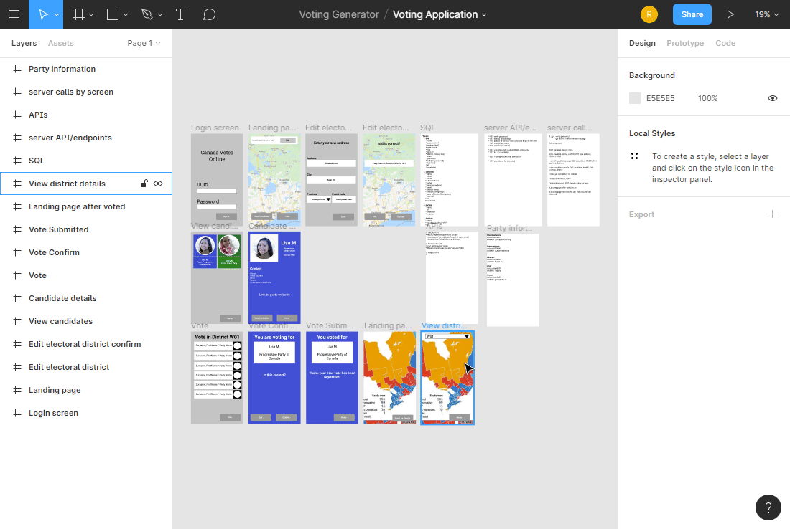
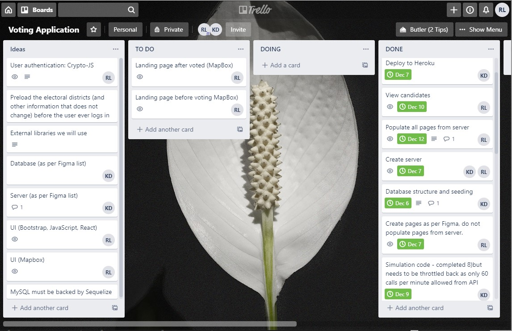

# Voting Application
Enable eligible voters to vote online and view election results. 

## Getting Started
All of the files can be loaded with your browser. Copy the files to your local directory and open localhost:5000.

### Prerequisites
A browser. Chrome was used for testing. 

### Installing
1. Go to https://github.com/ruthtech/voting-app and click on the "Clone or Download" button. 
2. Choose "Download ZIP". 
3. Unzip into a directory. If you're on Windows, open File Explorer and navigate to the download directory. Select the ZIP file, right click, and choose "Extract All". Accept the default location.
4. Once the file is unzipped, navigate to voting-app-master. 
   * Type "npm install" to install the prerequisites. 
   * Type "npm start" to start the Express server.
   * Use your browser to open "localhost:5000".

## Running the tests
There are no automated tests at this time. Manual tests were run as documented below.

### Function Tests
1. LOGIN
    * Can the user log in with a valid userid and password?
    * Can the user login in, with "admin" as the userid and "admin" as the password, and see the Simluation page instead of the Landing page?
    * Is the user prevented from logging in with an unknown userid?
    * Is the user prevented from logging in with an unknown password?
2. SIMULATION (admin only)
    * Does clicking the "Simulate" button update the district's shaded areas on the map with a party colour?
    * Does clicking "Reset" change all shaded areas back to grey?
3. VIEW CANDIDATE (voter only)
    * On the Landing page, click "View Candidates" > "Home". Is the user taken back to the Landing?
    * On the Landing page, click "View Candidates" > click on a candidate > do the generated links open a web page (no 404)?
    * "View Candidates" > Click on a candidate > "View Candidates". Is the page listing all candidates shown?
4. VOTE (voter only)
    * "Vote" > Click "Home". Is the Landing page shown?
    * "Vote" > Click on a candidate, click "Vote" > Click "Edit". User changes their choice, clicks "Vote". Is the candidate updated? 
    * "Vote" > Click on a candidate, confirm the vote. Is a confirmation page shown? When the user navigates back to the Landing, is the Vote button disabled?
5. EDIT DISTRICT (voter only)
    * "Edit District" > "Home". Is the Landing page shown?
    * "Edit District" > Change nothing, click Next, click Confirm. Is the same address shown on the confirmation page and when the user sees the Landing again is the same district shown?
    * "Edit District" > Change address to an invalid address (e.g. 1 Foo). Click "Next". Is the address changed to the closest existing address? When the user clicks Confirm, is that corrected address saved, the district of that address named and shaded?
    * "Edit District" > Start to change the address but click "Home" instead of saving it. Is the original address preserved?
    * "Edit District" > Save new valid address to the database. Is the district and shaded area updated to the new address?
    * "Edit District" > Change address. Afterwards click "Edit District" again. Is the expected (new) address shown?

Navigate to https://arcane-mountain-21933.herokuapp.com/ and log in with userid "happyfrog374" and password "technics".

Our Figma board shows the plan that we had to execute.

Our Trello board shows our Kanban

## Deployment
View this application on Heroku.  https://arcane-mountain-21933.herokuapp.com/ 

### Vote Online
To view the "Vote online" code, log in with userid "happyfrog374" and password "technics". 

### Simulation of a Vote
Log in to the same URL above with userid "admin" and password "admin". 
  * The simulation map is generated based on the opennorth data, which doesn't list voting districts in all areas of Canada. It's also the 2015 federal election data, which is the latest year in the opennorth database as of this writing.
  * After you click "Simulate Vote" it's fun to look at the yellow shaded areas. Those are the ones that list parties that would never win typically. (The 'Pirate Party of Canada' won Vancouver East once. Would pirates want to raid the Treasury?) To see who won, hover over the district with your mouse.
  * To see the list of parties that could be generated on the map, view [Registered Political Parties and Parties Eligible for Registration](https://www.elections.ca/content.aspx?section=pol&dir=par&document=index&lang=e)

## Built With
Development Tools:
  * [Visual Studio Code](https://code.visualstudio.com/docs/setup/setup-overview)
  * [Visual Studio Code Extension "Open in Browser"] 
    * Open VS Code.
    * Open the extensions pane and search for open in browser.
    * Select the version written by TechER and click Install.
  * [Google Chrome](https://www.google.com/chrome/browser/desktop/index.html)
  * [Studio 3T](https://studio3t.com/)
  * [Figma](https://www.figma.com)
  * [Trello](https://trello.com/)
  * [GIMP](https://www.gimp.org/)

Front end:
  * [Bootstrap](https://getbootstrap.com)
  * [React-Bootstrap](https://react-bootstrap.github.io/)
  * [React](https://reactjs.org/)
  * [Create-React-App](https://github.com/facebook/create-react-app)
  * [mapbox](https://www.mapbox.com/)
  * [loglevel](https://www.npmjs.com/package/loglevel)
  * [loglevel-plugin-remote](https://github.com/kutuluk/loglevel-plugin-remote)

Back end and middleware:
  * [MongoDB](https://www.mongodb.com/)
  * [Mongoose](https://www.npmjs.com/package/mongoose)
  * [dotenv](https://www.npmjs.com/package/dotenv)
  * [axios](https://www.npmjs.com/package/axios)
  * [express](https://www.npmjs.com/package/express)
  * [mapbox](https://www.mapbox.com/)
  * [loglevel](https://www.npmjs.com/package/loglevel)

## Contributing
This project is not open to contributions.

## Versioning
This project does not use versions at this time. 

## Authors
* Kevin O Davis [https://github.com/kevin-on-davis]
   * Investigation into opennorth to find the information about political candidates [opennorth](https://represent.opennorth.ca)
   * Investigation into randomuser.me to generate information for population of database [randomuser.me](https://randomuser.me/)
   * Server: endpoint creation and implementation, connected endpoints to backend database
   * MongoDB/Mongoose: 
      * Creation of MongoDB database and collections [MongoDB](https://www.mongodb.com/)
      * Initial population of MongoDB from randomuser.me data
      * Creation of the models (Mongoose) [Mongoose](https://www.npmjs.com/package/mongoose)

* Ruth Lee [https://github.com/ruthtech]
   * Investigation into mapbox for reverse geocoding from address
   * Investigation into mapbox for generating a map and a shaded polygon area (voting district) on a map as part of the UI
   * Investigation into loglevel and loglevel-plugin-remote to implement logging in both the back end and front end
   * Investigation into Heroku configuration to enable and disable log levels
   * Investigation into good web API design ("Web API Design: Crafting Interfaces that Developers Love" by Brian Mulloy)
   * Front end (React, Bootstrap, React-Bootstrap, create-react-app)
   * [mapbox](https://www.mapbox.com/) (front end and server)
   * [dotenv](https://www.npmjs.com/package/dotenv)
   * [logging](https://www.npmjs.com/package/loglevel) and [React logging](https://github.com/kutuluk/loglevel-plugin-remote)
   * Server: creation of express server skeleton that initially returned mock data instead of database records, endpoint creation and implementation, and created the scripts that bulk updated or bulk populated the voter and district collections in the database.
   * MongoDB/Mongoose:
       * Debugged and modified the connection to MongoDB and Mongoose models for Heroku
       * Updated population of MongoDB, changing any randomuser.me address that didn't exist into the closest existing address including postal code, longitude and latitude. (mapbox determined what was the closest address.)
       * Created district collection in MongoDB from the opennorth data. Updated Mongoose model to match.
   * Deployment to Heroku

## License
MIT

## Acknowledgments
Thanks to the following:
* [U of T Coding Bootcamp] https://bootcamp.learn.utoronto.ca/coding/
* Icon of Canada flag (circle) made by [Roundicons](https://www.flaticon.com/authors/roundicons) from [Flaticon](https://www.flaticon.com/)
* Canada flag on the login page made by [Freepik](https://www.flaticon.com/authors/freepik) from [Flaticon](https://www.flaticon.com)
* Latitude and longitude manual lookup [latlong.net](https://www.latlong.net/)
* Article [Best Practices for Client-Side Logging and Error Handling in React](https://www.loggly.com/blog/best-practices-for-client-side-logging-and-error-handling-in-react/) for guidance on how to send React logging messages to the server. (This means that even if a voter doesn't know how to get and submit any React log error messages, the logs still have them.)
* Article/Book [Web API Design: Crafting Interfaces that Developers Love](https://pages.apigee.com/rs/apigee/images/api-design-ebook-2012-03.pdf) by Brian Mulloy of apigee
* [Tristen Brown](https://blog.mapbox.com/mapbox-gl-js-react-764da6cc074a) Mapbox tooltip code [mapbox-react-examples](https://github.com/mapbox/mapbox-react-examples/tree/master/react-tooltip) The code used to create tooltips on hover over the Simulation map was copied from that GitHub repository. The code was modified slightly to show the tooltip only for voting district features. 
* [Elections data](https://represent.opennorth.ca/) Represent Civic Information API ("opennorth") provided all of the information that was used to find the voting districts, candidates running in those districts, and the districts' geographical boundaries.

  
